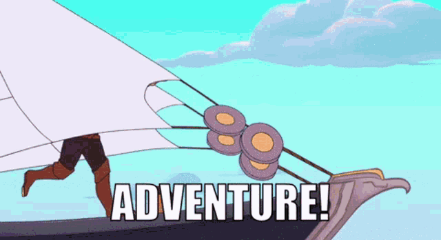

A Wizard of Earthsea is the first of the series of epic children’s (teenager’s, YA even?) fantasy, set in the water world known, aptly enough, as “Earthsea.” I’ve always considered timelessness to be a mark of good fantasy – and Earthsea is no exception. I have to be honest, when I first picked a new hardcover of this book, I had no idea it was such an early entry in the fantasy genre. Only once I finished it and began pondering this review did I look up the publication date – nearly spitting out my coffee – to note that this book came out **IN FREAKIN 1968**. 

Wow, okay, I’m good.

Perhaps I’m not as well versed in fantasy outside of my comfy hobbit-hole-sized bubble of Tolkein fandom and dark academia, but I was really surprised that a book with such a novel approach to the genre wasn’t a more recent creation. Anyway, I should really get on with talking about, you know, the actual story.

This is a tale of the boy known as Sparrowhawk, who would one day become one of the greatest wizards in all of Earthsea. In fact, the author, in true fairy-tale fashion, tells us as much right up front, along with a brief description of his homeland:

> **“The island of Gont, a single mountain that lifts its peak a mile above the storm-racked Northeast Sea, is a land famous for wizards. From the towns in its high valleys and the ports on its dark narrow bays many a Gontishman has gone forth to serve the Lords of the Archipelago in their cities as wizard or mage, or, looking for adventure, to wander working magic from isle to isle of all Earthsea. Of these some say the greatest, and surely the greatest voyager, was the man called Sparrowhawk, who in his day became both dragonlord and Archmage. His life is told of in the Deed of Ged and in many songs, but this is a tale of the time before his fame, before the songs were made.”**

And from there, we’re off to the races, from the early life story of the boy. He grows up in a provincial village, and given the name Duny – no wonder he later went with “Sparrowhawk” – and he soon finds that he has a talent for magic.

Magic, in the world of Earthsea, takes a very interesting form. In many ways it fits the classical, tolkein-esque [soft magic](https://habitwriting.com/hard-magic-vs-soft-magic/) system that operates at a level never explained to the reader, nor fully understood by the characters. But while many of the mechanisms of magic are left to the imagination, there is still a fair bit explained at the surface level. Magic is something one can learn and study, and (in most places at least) the profession of wizardry is considered honorable. There’s apparently [some debate](https://mythcreants.com/blog/building-earthsea-how-le-guin-laid-a-shaky-foundation-for-her-world/) about where Earthsea fits into the Sandersonian scale of Hard/Soft magic, but given how old this first entry is, I’m not shocked it doesn’t fit neatly in a modern category.

But back to Ge- oops, I mean Sparrowhawk. Forget I said that, okay?

After learning the basics of magic from the local village witch (who happens to be his Aunt), Sparrowhawk proves he has a talent for magic by saving his entire village from a horde of invading barbarians – as you do. How does the young lad pull this off, you ask? Why, by covering his entire village in fog he can manipulate into shapes and specters to scare the breeches off the invaders, enabling the villages to drive them off.

This gets him noticed by the most powerful wizard on the island, who takes him on as an apprentice, teaching the boy the ropes and eventually granting him his true name. You see, in the world of Earthsea, a person, like all things in the world living or inert, has a true name to which their very being is tied. For people, these names are given by wizards when they come of age (more or less at puberty). This name is seldom used, as knowing it gives someone (especially wizards) power over you. This is explained a bit more thoroughly in Le Guin’s short story [The Rule of Names](https://en.wikipedia.org/wiki/The_Rule_of_Names), but suffice it to say that a person keeps that name to themselves, and goes by a nickname most of the time, like “Sparrowhawk”

The boy, whose true name we learn is *Ged*, has a brush with the darker side of magic when he is tricked into nearly releasing some unspeakable shadowy horror that was written about in one of his master Ogion’s spellbooks. Despite this, he is still impatient and chafes at the pace and confines of his lessons. Ogion gives him a choice to continue his studies with him, or to attend the prestigious wizard academy on the faraway island of Roke. You can probably guess which he chooses.

And so begins the globetrotting adventures of Sparrowhawk. Things may get a bit hard to follow without a map, but thankfully, there’s a handy set of them on the [author’s website](https://www.ursulakleguin.com/maps-of-earthsea). Okay, onward to ADVENTURE!

First, our boy makes it to Roke, where he quickly makes exactly 1 best friend, and one hated rival. The twist is, of course, that those two are friends themselves. His rival, Jasper, seems friendly enough on the surface, but gives off some snobbish vibes, which the rustic-born Ged immediately takes personally. His best friend Vetch, on the other hand, has a much more laid-back attitude, and seems to want nothing more than to eat snacks and vibe – very relatable.

One day, the rivalry comes to a head, and Ged ends up releasing the same horrifying shadow creature from before, while trying to one-up Jasper. The thing, the nature of which is never fully explained, immediately lunges at Ged and starts trying to claw his face off – did I mention this was written as a children’s book? The heroic efforts of the Archmage of the school drive the creature away, but at the cost of his life.

*A Wizard of Earthsea* then fully shifts gears into a redemption arc, with Ged recovering, completing his studies, and becoming a journeyman wizard, all the while trying to evade the shadow creature that ceaselessly hunts him. Along the way he bamboozles a dragon, binding it with his knowledge of its true name, escapes from the machinations of an eldritch power trapped in a stone, transforms into a hawk and nearly gets stuck (Earthsea animal transformations apparently operate on Animorphs rules), and seeks out his old mentor Ogion for advice on evading the shadow.

When the old wizard tells him he must face the shadow instead of fleeing it, he does just that, flipping the script and pursuing his tormentor across oceans and seas in a whirlwind tour of Earthsea. He runs into his old pal Vetch on his home island of Iffish, and together they set out to destroy the shadow once and for all. The end of the book takes us into even stranger territory, with the two friends traveling literally off the map, and setting up a final confrontation in an upside-down, [World’s-End kind of place](https://en.wikipedia.org/wiki/List_of_locations_in_Pirates_of_the_Caribbean#Davy_Jones'_Locker) that appears to Vetch only as an endless sea, but to Ged as a beach he can walk across. There, he finds his shadow, in a twist, names it his own name, and merges with it to become whole…yeah, it was a little hard for me to follow too.

The overarching theme of Earthsea seems to be that violence is often not the answer, and with friends and resourcefulness, one can overcome any obstacle. There’s a fair bit of symbolism in the nature of the shadow, its connection to Ged, and the fate of characters that are shown to have darkness in their hearts. Overall, an enjoyable story and a different kind of fantasy that we still don’t see enough of, in my opinion.