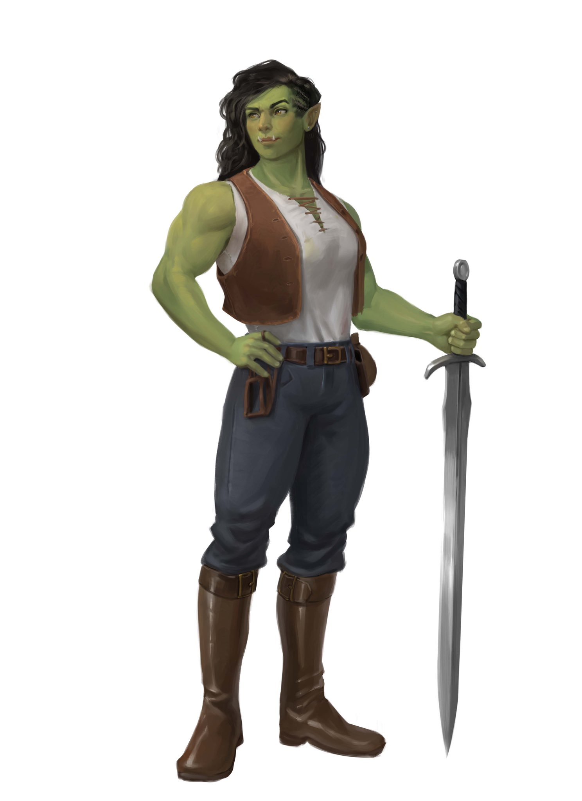
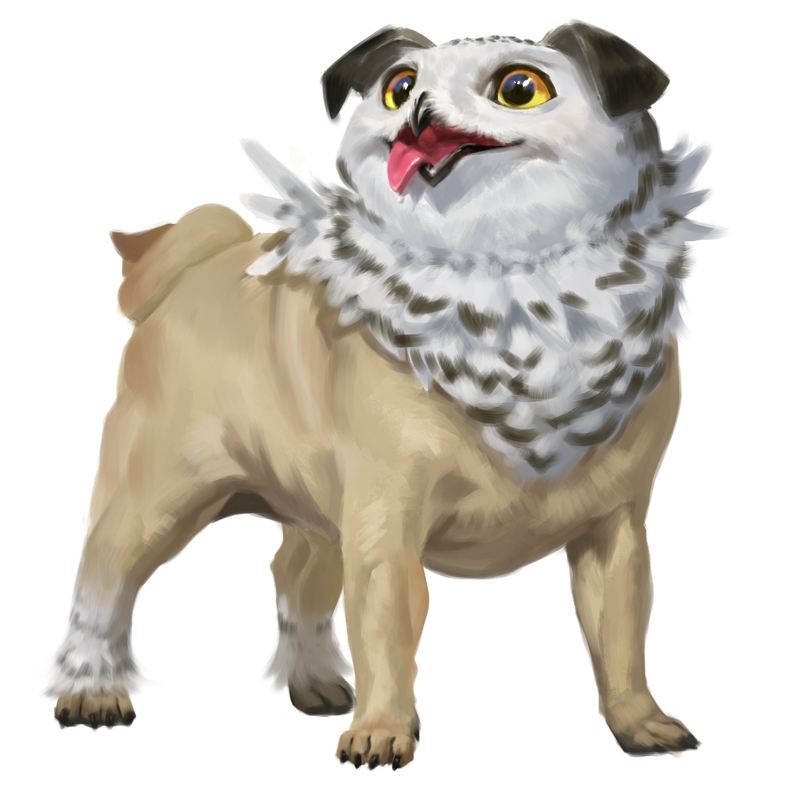
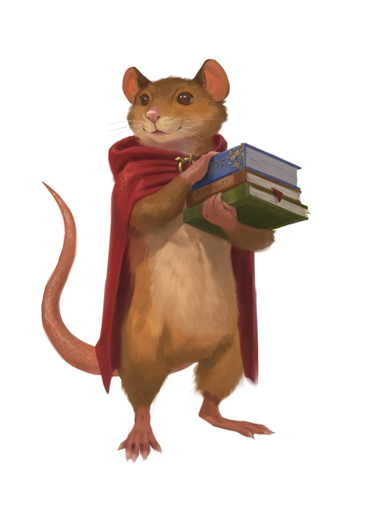

Oh boy. I've got to be honest with you all, I had a hard time finishing this book...

Because I REALLY didn't want it to end! Despite only clocking in at 350-ish pages, I took about a week to get through it, really trying to savor every chapter. Much like the POV character Viv, my enjoyment, immersion, and connection to the charming cast of characters in the novel grew, almost by the page. *Bookshops & Bonedust* is set twenty years before the events of Baldree's breakout novel *Legends & Lattes*, back when Viv the retired adventurer-for-hire was only just hitting her stride in the monster and baddie hunting business. Obligatory warning that there be **SPOILERS AHEAD**, so stop now if you haven't read the book yet!

If *Legends & Lattes* made me want to curl up with a hot coffee in a plush cafe booth, *Bookshops & Bonedust* has me reaching for a well-worn book off a tall shelf, and curling back up to read. Twenty years before Orc mercenary Viv settled down in the city of Thune to open a curious and comfy shop serving piping hot cups of a novel bevererage called Coffee, she was injured while running with a famed mercenary group and left behind to heal in the sleepy seaside town of Murk. The early chapters are a bit of slow burn, with Viv exploring the town, meeting many of the denizens we will soon come to love, and awkwardly attuning to the lifestyle of someone who doesn't swing a sword for a living while she awaits both her leg mending and the return of her mercenary outfit.

The real magic of the book becomes apparent as we are shown, through the same videogame-style series of introductions to the main characters, new sides of Viv that are somehow perfectly fitting to the gruff and loveable Orc that we met back in *Legends*. Desperate for something to do, Viv wanders into a dusty and dingy boardwalk bookshop, leading her to meet the proprietor, a foul-mouthed ratkin (mouse-person) named Fern, and her pet Gryphet (a novel take on the mythical [Griffin/Gryphon](https://en.wikipedia.org/wiki/Griffin#:~:text=The%20griffin%2C%20griffon%2C%20or%20gryphon,talons%20on%20the%20front%20legs.), feating an owl's head and a pug's body) the adorably named Potroast.

Sidebar here, I LOVE this little fuzz & fur ball. Seriously, just look at the official art for this guy.

Fern is also loveable in the same way that other characters in *Legends* draw you in: she's headstrong, in over her head (in this case, the bookshop is on the brink of going out of business), and an earnest lover of books. While Viv might be the protagonist of the story, Fern is its heart. The titular Bookshop itstel, *Thistleburr*, turns out to be the stage for much of the novel's progression, and serves as a physical focal point from there on out. 

The formula is recognizeable from *Legends & Lattes*: Viv eventually makes a deal with Fern to help out around the shop in exchange for free reads and reccomendations (Fern's Idea), and over the course of the story we see Thistleburr transformed from dark, dusty, and uninviting to fresh, clean, welcoming, and downright comfy. Fern herself gains confidence as business starts to take off, and even invents (in this world at least) novel real-world trends in bookselling, such as author signings and mystery book-bag sales. What's amazing about all of this is while it's more or less the exact same videogame story progression approach in Baldree's last novel, he manages to make it feel fresh at the same time. The cast of characters, aside from Viv and Fern (and of course *Potroast!!*) are vibrant and lively: The sapphic love-interest Maylee, the imposing serpentfolk Gatewarden (chief of police) Iridia, and quirky gnomish future co-adventurer and pointy object enthusiast Gallina, among many others.

Trouble certainly isn't far away, as the town of Murk soon comes to realize. Against the backdrop of cozy bookshops and fresh baked sweetbreads, a suspicious man in gray is spotted by Viv, who reminds her most unpleasantly of the feared Necromancer *Varine* that her mercenary band was hunting when she was first injured. I could dive a little deeper into the story from there, but trust me when I say, just go read it; it will be worth your while, every page of it!

At the end of the day, *Bookshops & Bonedust* is a story about finding ourselves, sometimes through circumstances we would not have chosen, and through people we would not have met otherwise. And sometimes, we aren't the people we're meant to be just yet when it happens, and that is part of the beauty of life. It's heartwarming, bittersweet, and cozy all at once, and somehow feels as fresh as a newly printed page, and yet also timeless as a dusty old paperback. A wonderful tale, start to finish <3