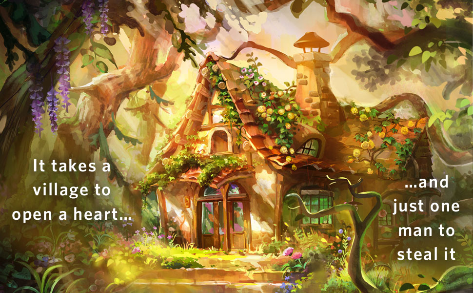

I have a confession to make. Despite the old saying, I frequently judge (or at least make impulse decisions to buy) books by their cover. But hey, sometimes it all works out – very much so in the case of The Spellshop, the new cozy romantasy novel by Sarah Beth Durst. Sporting a colorful cast of characters just as delightful as the cover art and lavender colored edges, the book takes us on a journey of self-discovery, of finding family and community, and how we all ultimately need to look out for each other. 

There’s a lot to like in this book, and I’ll be diving into as much as I can squeeze into a short review. I’ll also go over the things that didn’t click with me, and aspects of the book that made the reading drag in some parts; as always, your mileage may vary. So then, without further ado, let’s tie our boats off at the doc, and hike up the trail to Kiela and Caz’s Jam (and Spell) Shop!

**Warning: \*\*\*Minor Spoilers Ahead\*\*\***

Opening on city engulfed in the flames of a bloody revolution, introverted librarian Kiela and her assistant Caz (a sentient spider plant), make a last-minute escape from the great library, heading out to sea in a dinghy laden with crates of carefully cataloged spell books. With nowhere else to go, Kiela settles on dropping anchor at the remote island of Caltrey, the place she was born, raised, and never expected to return after her parents sought out a better life in the capital city of Alyssium.

After she arrives, Kiela tries to keep completely unnoticed, hoping the islanders never suspect that anyone, let alone a former Caltreyan, has moved back into her parent’s abandoned, vine-choked cottage outside the island’s village. We quickly learn that she’s not just trying to avoid people out of her own preferences, though. It turns out, by leaving with a number of valuable and highly controlled texts of magic, Kiela and Caz have broken some very stringent imperial laws – assuming the empire still exists, but Kiela’s not about to head back and find out – and the penalty for doing so would be death, at best. Nevertheless, they don’t remain unknown for too long.

The Spellshop takes it very slow once Kiela and Caz arrive on the island, sometimes a bit too slow. There’s a lot of introspection, awkward flailing into social situations that she’d rather avoid, and a strong sense of wistfulness that pervades the first half of the book. Exploring the island, Kiela recognizes places and recalls flashes of her adolescence on a Caltrey that looked different to the one she now sees – signs of disrepair, plants withering, and sudden, violent storms that occur more and more frequently. Durst does a really clever job here in paralleling real-world climate change in The Spellshop, turning fantasy escapism on its head and creating a sense of familiarity in a world full of talking plants, centaurs, and merhorse-herders.

As we follow Kiela and Caz along, we start to learn more about the world they inhabit, and through all of the friends she (hesitantly at first) makes along the way, the strong sense of community the islanders share. We see selflessness and kindness win out over fear and greed, and Kiela slowly comes out of her shell as she discovers that she does need people in her life – especially those who want to be in it.

> Family isn’t always the people you’re related to.
>
> \- Larran

While the book absolutely won me over in the end, I did struggle with it at times. The slow-burning hallmark movie-style romance, coupled with Kiela’s near-pathological self-esteem issues dragged the story out several chapters more than felt necessary. Early parts of the novel also suffer from an overabundance of telling instead of showing, with Kiela’s inner monologue giving the audience a firehose of exposition about her world. In fairness, it’s very clear that our blue-haired heroine is several flavors of neurodivergent, so my distaste for this could be colored by my own self-consciousness.

Things pick up as we move forward, as plot elements intertwine and twist in unexpected ways. Tension, deception, and close calls keep Kiela, and those around her on their toes. Enemies, friends, and lovers all collide in a spectacular finish that cruises back into the cozy fantasy genre just in time. It’s a wilder ride than I expected from the cover, but perhaps that’s the intent behind the old wisdom after all.

At its core, The Spellshop teaches us that, no matter who we are, or where we come from, we are all part of some community or another. While its cozy, cottagecore aesthetic is sure to appeal to the tired, jaded cityfolk among us, the book emphasizes the importance of finding community AND family wherever you are. And in today’s world of rising costs of living, fear, uncertainty, and isolation, that’s a powerful message.